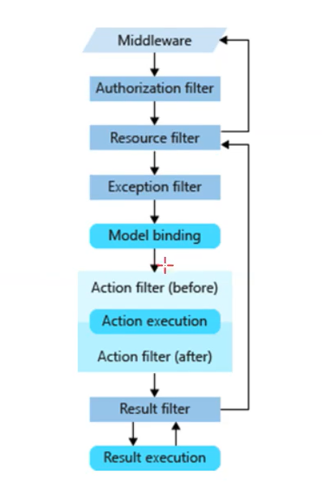

# .Net Core之五大Filter

AOP:在不修改原有代码的前提下，动态增加新的功能；

- AuthorizationFilter 鉴权授权
- ResourceFilter 资源
- ExceptionFilter  异常
- ActionFilter   方法
- ResultFilter  结果过滤

# ActionFilter

##  实现IActionFilter

可以标记在Action或控制器上 

public class MyActionFilterAttribute : Attribute, IActionFilter，

执行步骤：

- controller 构造函数
- MyActionFilterAttribute --->OnActionExecuting  方法执行前
- AOP切面：执行方法前
- 执行Action
- AOP切面：执行方法后
- MyActionFilterAttribute --->OnActionExecuted   方法执行后

## 实现ActionFilterAttribute 

## 应用

- 日志记录

- Filter的多种注册和扩展

  - [myFilter.MyActionFilter]// 必须有 无参构造器

  - [TypeFilter(typeof(myFilter.MyActionFilterAttribute))]//可以没有无参构造器，支持依赖注入

  - [ServiceFilter(typeof(myFilter.MyActionFilterAttribute))]//可以没有无参构造器，支持依赖注入，但必须要注册服务

    containerBuilder.RegisterType(typeof(MyActionFilterAttribute)).PropertiesAutowired();//支持属性注入

- IFilterFactory 扩展定制  ---需要IOC容器配合完成  容器中注入

  [MyFilterFactory(typeof(MyActionFilterAttribute))]

```c#
 public class MyFilterFactoryAttribute : Attribute, IFilterFactory
    {
        private readonly Type _Type = null;

        public MyFilterFactoryAttribute(Type type)
        {
            _Type = type;
        }

        public IFilterMetadata CreateInstance(IServiceProvider serviceProvider)
        {
            var obj = serviceProvider.GetService(_Type);

            return (IFilterMetadata) obj;
        }

        public bool IsReusable => true;
    }
```

## 作用范围、执行顺序

```c#
 //全局注册过滤器
services.AddMvc(opt =>
                {
                    opt.Filters.Add<MyActionFilterAttribute>();
                });
```

执行顺序：可以通过Order 进行控制 从小到大；

- 控制器构造函数
- 全局OnActionExecuting  
  - 控制器OnActionExecuting  
    - 方法OnActionExecuting  
      - 执行方法（action）
    - 方法OnActionExecuted 
  - 控制器OnActionExecuted   
- 全局OnActionExecuted   

# ResourceFilter

适合做缓存，只要对 context.Result 进行了赋值，就不往下走，直接返回；



# Filter匿名

全局注册Filter对所有action都有效，怎么避开Filter呢？

【AllowAnyone】也可以在 OnActionExecuting   中进行检查

# ExceptionFilter  

- 自定义 CustomExceptionFilterAttribute :IExceptionFilter

- 异常是否处理过

- 根据请求，返回json 或 错误页面

- 设置异常已经处理

  一般为全局注册：addMvc(opt=>{opt.filter.add})

## ExceptionFilter 能捕获哪些异常？

- 控制器实例化异常 ------可以
- 异常发生在try-catch中--不可以
- 在视图中发生异常----不可以
- service层中发生异常---可以
- action中发生异常-----可以
- 请求路径异常----不可以    可以使用中间 进行处理 状态不为200的

# IResultFilter

x渲染视图之前执行

​	OnResultExecuting

渲染视图之后执行

​	OnResultExecuted

## 应用

自定义类实现IResultFilter

标记在Action方法上

执行顺序：执行前----》视图执行----》执行后，

多国语言系统，选择不同的视图渲染执行；

# 鉴权授权

```c#
 1、
 app.UseAuthentication();//鉴权 是否登录，登录的是谁
 app.UseAuthorization();//授权 使用有权限
2
    services.AddAuthentication();
3
    标记鉴权授权
    【Microsoft.AspNetCor.Authorization.Authorize】
```

## 角色授权

【Authorize(Roles-"Admin,Teacher")】 有一个都可以，代码中写死，不灵活

## 策略授权


