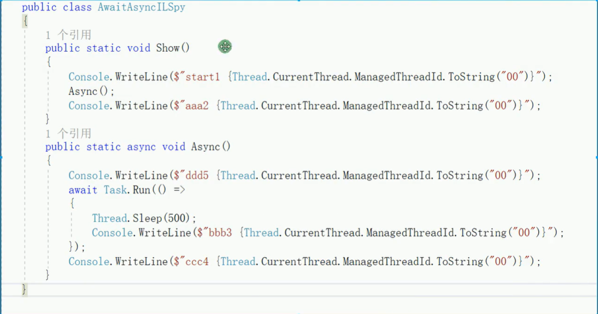
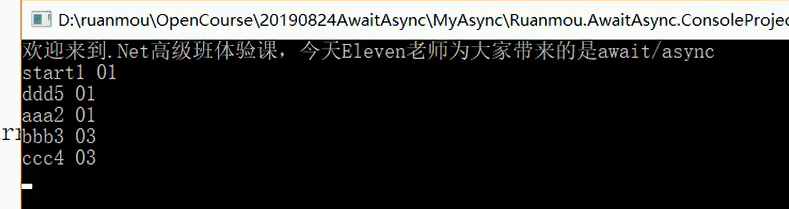
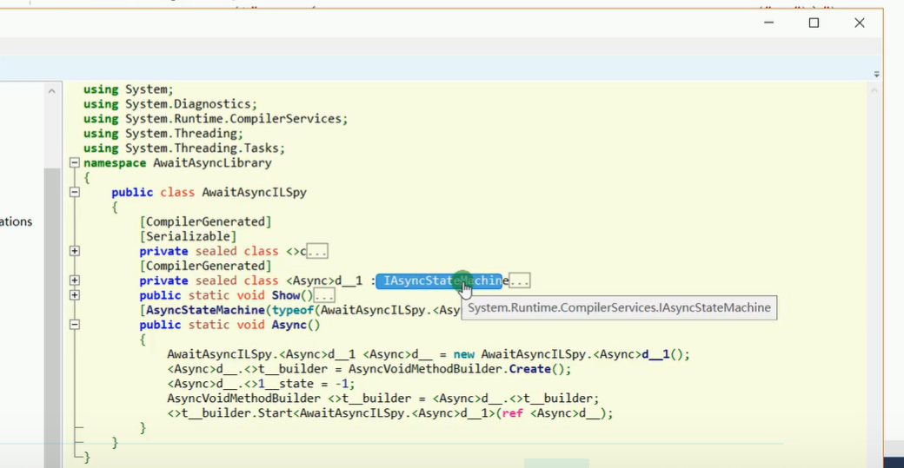
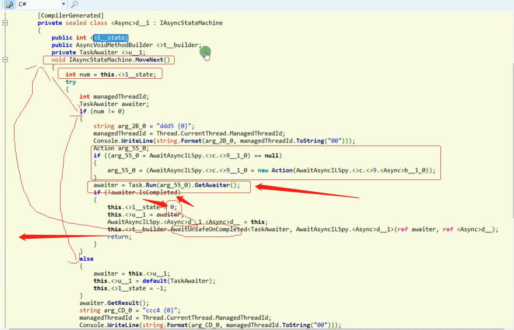

## 1、async函数的编译方式

async/await 是C# 5.0 退出的异步代码编程模型，其本质是编译为**状态机**，	

反编译C# 源码，会将async 和await 语法糖去掉；

**调用线程**：

- 初始化【AsyncVoidMethodBuilder.Create()】，并将状态：State=-1；
- 下图执行MoveNext()，由于State为-1；num为-1，执行if语句块内容，
  - 执行**调用线程**输出"ddd5 "
  - 声明Action委托，然后，Task.Run(action) 得到GetAwaiter
  - awaiter.IsCompleted,肯定是没有完成；
  - 重置状态机状态，替换awaiter，递归调用
  - **调用线程**return
- **调用线程**执行后续代码：“aaa2”

https://blog.csdn.net/sD7O95O/article/details/108288859
