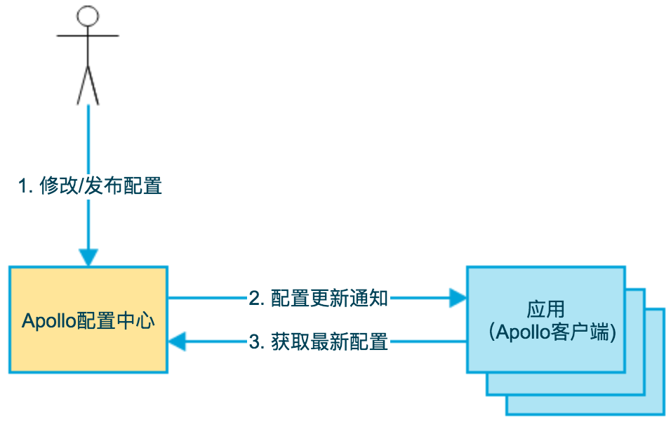
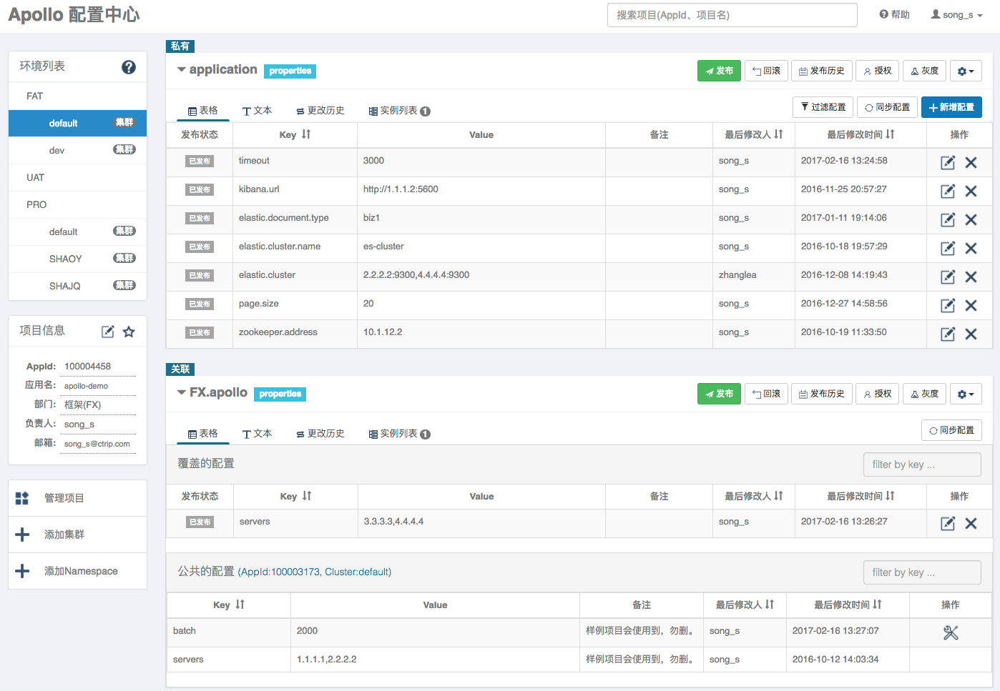
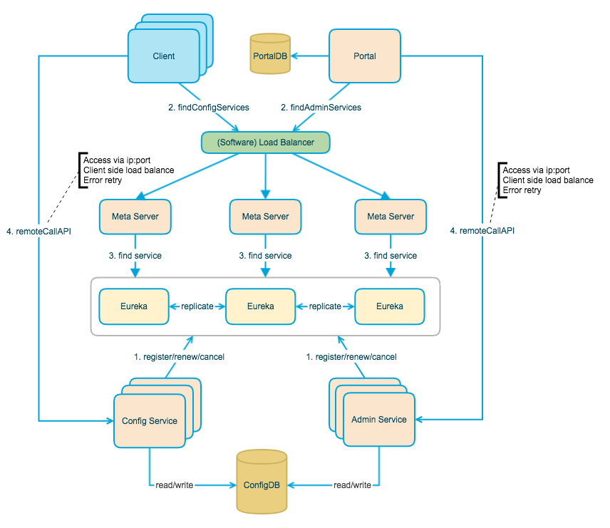
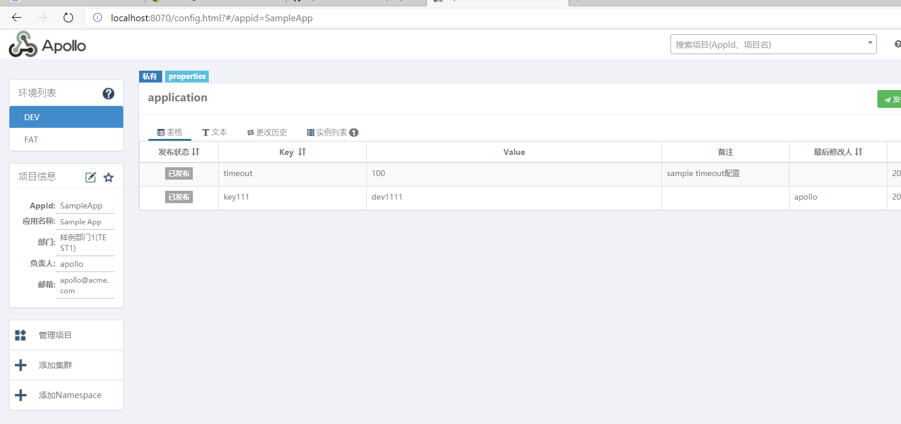
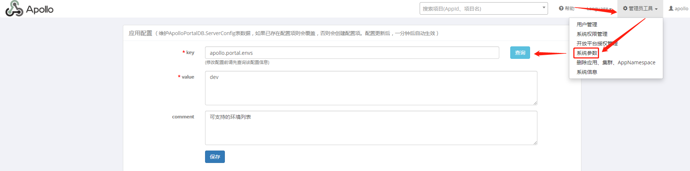

# Apollo是什么？

## 	简介

Apollo（阿波罗）是携程框架部门研发的开源配置管理中心，能够集中化管理应用不同环境、不同集群的配置，配置修改后能够实时推送到应用端，并且具备规范的权限、流程治理等特性。

Apollo支持4个维度管理Key-Value格式的配置：

1. application (应用)
2. environment (环境)
3. cluster (集群)
4. namespace (命名空间)

同时，Apollo基于开源模式开发，开源地址：https://github.com/ctripcorp/apollo

## 功能

- 管理不同环境，不同集群的配置

- 配置修改实时生效（热发布）

- 版本管理

- 灰度发布

- java  .net 方便使用，开发平台Api

- 部署简单，以来java+MySql

  

  如下即是Apollo的基础模型：

  1. 用户在配置中心对配置进行修改并发布
  2. 配置中心通知Apollo客户端有配置更新
  3. Apollo客户端从配置中心拉取最新的配置、更新本地配置并通知到应用

  

  



上图简要描述了Apollo的总体设计，我们可以从下往上看：

- `Config Service`
  提供配置的读取、推送等功能，服务对象是Apollo客户端
- `Admin Service`
  提供配置的修改、发布等功能，服务对象是Apollo Portal（管理界面）
- `Config Service`和`Admin Service`都是`多实例`、`无状态`部署，所以需要将自己注册到Eureka中并保持心跳
- 在Eureka之上我们架了一层`Meta Server`用于封装Eureka的服务发现接口
- `Client`通过域名访问Meta Server获取Config Service服务列表（IP+Port），而后直接通过IP+Port访问服务，同时在Client侧会做load balance、错误重试
- `Portal`通过域名访问Meta Server获取Admin Service服务列表（IP+Port），而后直接通过IP+Port访问服务，同时在Portal侧会做load balance、错误重试
- 为了简化部署，我们实际上会把Config Service、Eureka和Meta Server三个逻辑角色部署在同一个JVM进程中


# docker 安装apollo

## 镜像获取

```shell
docker pull pengfeilu/apollo-portal:1.6.0
or
docker pull apolloconfig/apollo-portal

docker pull pengfeilu/apollo-configservice:1.6.0
or
docker pull apolloconfig/apollo-configservice

docker pull pengfeilu/apollo-adminservice:1.6.0
or
docker pull apolloconfig/apollo-adminservice

docker pull pengfeilu/apollo-mysql:5.7.22_1.6.0 #基于mysql 5.7.2 包含数据初始化
```

## 安装apollo

- 创建环境管理配置文件

  ```properties
  // 这个文件是用于配置apollo-portal管理的各个环境的Eureka地址
  vim apollo-env.properties
  // 创建好之后添加以下配置
  
  #本地默认环境配置，没啥用
  local.meta=http://localhost:8080
  #下面的环境，你有几个就添加几个，没有的或者不需要的可以直接删掉
  dev.meta=http://172.20.0.4:8080
  fat.meta=http://172.20.0.14:8080
  
  通过docker-compose.yml 指定网关
  每个service 设置固定网段内，网络IP
  
  ```

- 创建**docker-compose.yml**文件

  ```yaml
  version: "3"
  
  services:
    apolo-portal:
      container_name: apollo-portal
      image: pengfeilu/apollo-portal:1.6.0
      ports:
        - "8070:8070"
      volumes:
        - "./opt/logs/portal100003173:/opt/logs/100003173"
        - "./prop/apollo-env.properties:/apollo-portal/config/apollo-env.properties"
      environment:
        - spring_datasource_url=jdbc:mysql://172.20.0.2:3306/ApolloPortalDB?characterEncoding=utf8
        - spring_datasource_username=root
        - spring_datasource_password=root
      networks:
        extnetwork:
          ipv4_address: 172.20.0.3
  
    apollo-mysql:
      container_name: apollo-mysql
      image: pengfeilu/apollo-mysql:5.7.22_1.6.0
      ports:
        - "13306:3306"
      volumes:
        - "./mysql/data:/var/lib/mysql"
        - "./mysql/logs:/logs"
       # - "./etc/localtime:/etc/localtime:ro"
      environment:
        - MYSQL_ROOT_PASSWORD=root
        - UPDATE_EUREKA_URL_SQL=update ApolloConfigDB.ServerConfig set `Value`="http://172.20.0.4:8080/eureka/" where `Key`="eureka.service.url"
      networks:
        extnetwork:
          ipv4_address: 172.20.0.2
   
    apollo-configservice:
      container_name: apollo-configservice
      image: pengfeilu/apollo-configservice:1.6.0
      ports:
        - "8080:8080"
      depends_on:
        - apollo-mysql
      volumes:
        - "./opt/logs/configservice100003171:/opt/logs/100003171"
      environment:
        - spring_datasource_url=jdbc:mysql://172.20.0.2:3306/ApolloConfigDB?characterEncoding=utf8
        - spring_datasource_username=root
        - spring_datasource_password=root
        - host_ip=172.20.0.4
      networks:
        extnetwork:
          ipv4_address: 172.20.0.4
    
    apollo-adminservice:
      container_name: apollo-adminservice
      image: pengfeilu/apollo-adminservice:1.6.0
      ports:
        - "8090:8090"
      depends_on:
        - apollo-mysql
        - apollo-configservice
      links:
        - apollo-configservice
      volumes:
        - "./opt/logs/adminservice100003172:/opt/logs/100003172"
      environment:
        - spring_datasource_url=jdbc:mysql://172.20.0.2:3306/ApolloConfigDB?characterEncoding=utf8
        - spring_datasource_username=root
        - spring_datasource_password=root
        - host_ip=172.20.0.5
      networks:
        extnetwork:
          ipv4_address: 172.20.0.5
      
    apollo-mysql1:
      container_name: apollo-mysql1
      image: pengfeilu/apollo-mysql:5.7.22_1.6.0
      ports:
        - "23306:3306"
      volumes:
        - "./mysql/data1:/var/lib/mysql"
        - "./mysql/logs1:/logs"
       # - "./etc/localtime:/etc/localtime:ro"
      environment:
        - MYSQL_ROOT_PASSWORD=root
        - UPDATE_EUREKA_URL_SQL=update ApolloConfigDB.ServerConfig set `Value`="http://172.20.0.14:8080/eureka/" where `Key`="eureka.service.url"
      networks:
        extnetwork:
          ipv4_address: 172.20.0.12
   
    apollo-configservice1:
      container_name: apollo-configservice1
      image: pengfeilu/apollo-configservice:1.6.0
      ports:
        - "18080:8080"
      depends_on:
        - apollo-mysql1
      volumes:
        - "./opt/logs/1configservice100003171:/opt/logs/100003171"
      environment:
        - spring_datasource_url=jdbc:mysql://172.20.0.12:3306/ApolloConfigDB?characterEncoding=utf8
        - spring_datasource_username=root
        - spring_datasource_password=root
        - host_ip=172.20.0.14
      networks:
        extnetwork:
          ipv4_address: 172.20.0.14
    
    apollo-adminservice1:
      container_name: apollo-adminservice1
      image: pengfeilu/apollo-adminservice:1.6.0
      ports:
        - "18090:8090"
      depends_on:
        - apollo-mysql1
        - apollo-configservice1
      links:
        - apollo-configservice1
      volumes:
        - "./opt/logs/1adminservice100003172:/opt/logs/100003172"
      environment:
        - spring_datasource_url=jdbc:mysql://172.20.0.12:3306/ApolloConfigDB?characterEncoding=utf8
        - spring_datasource_username=root
        - spring_datasource_password=root
        - host_ip=172.20.0.15
      networks:
        extnetwork:
          ipv4_address: 172.20.0.15
      
  networks:
     extnetwork:
        ipam:
           config:
           - subnet: 172.20.0.0/16
             gateway: 172.20.0.1
  ```

  

## docker-compose构建

```shell
docker-compose up -d

#重启
docker-compose restart
// 查看服务
docker ps -a | grep apollo

#时间比较长，
apollo-mysql             | Version: '5.7.22'  socket: '/var/run/mysqld/mysqld.sock'  port: 3306  MySQL Community Server (GPL)
apollo-mysql1            | 2020-12-02T08:34:13.003288Z 0 [Note] Event Scheduler: Loaded 0 events
apollo-mysql1            | 2020-12-02T08:34:13.003572Z 0 [Note] mysqld: ready for connections.
apollo-mysql1            | Version: '5.7.22'  socket: '/var/run/mysqld/mysqld.sock'  port: 3306  MySQL Community Server (GPL)
apollo-portal            | Waiting for server startup...............................
apollo-portal            | Wed Dec  2 16:36:50 CST 2020 Server started in 155 seconds!
apollo-adminservice1     | Waiting for server startup.........................................
apollo-adminservice1     | Wed Dec  2 16:37:44 CST 2020 Server started in 205 seconds!
apollo-adminservice      | Waiting for server startup..........................................
apollo-adminservice      | Wed Dec  2 16:37:49 CST 2020 Server started in 210 seconds!
apollo-configservice1    | Waiting for server startup............................................
apollo-configservice1    | Wed Dec  2 16:37:58 CST 2020 Server started in 220 seconds!
apollo-configservice     | Waiting for server startup............................................
apollo-configservice     | Wed Dec  2 16:37:58 CST 2020 Server started in 220 seconds!
```


# 启动配置

- ## apollo配置管理平台地址

[Apollo配置中心] http://localhost:8070/  默认管理员用户名:`apollo` 密码: `admin`



- ## 修改环境配置文件apollo-env.properties

```properties
#本地默认环境配置，没啥用
local.meta=http://localhost:8080
#下面的环境，你有几个就添加几个，没有的或者不需要的可以直接删掉
dev.meta=http://172.20.0.4:8080
fat.meta=http://172.20.0.14:8080
```

- ## 修改ApolloPortalDB.ServerConfig表中的envs字段

找到`系统参数`配置并查找`apollo.portal.envs`配置，并将其修改为你需要支持的多个环境，记得用英文的逗号隔开



- ## 重启apollo-portal服务

  ```shell
  重启apollo-portal服务
  docker restart apollo-portal
  ```

  


## 镜像创建过程

### apollo-mysql镜像

- 获取sql脚本，[下载](https://github.com/ctripcorp/apollo/tree/master/scripts/docker-quick-start/sql)

- 配置文件

  ```
  vim mysql.cnf
  1
  ```

  ```
  [mysql]
  default-character-set = utf8
  [mysql.server]
  default-character-set = utf8
  [mysqld_safe]
  default-character-set = utf8
  [client]
  default-character-set = utf8
  [mysqld]
  character_set_server=utf8
  init_connect='SET NAMES utf8'
  1234567891011
  ```

- 添加初始化数据库脚本

  ```
  vim init_db.sh
  1
  ```

  ```
  mysql -uroot -p$MYSQL_ROOT_PASSWORD <<EOF
  source $WORK_PATH/apolloconfigdb.sql;
  source $WORK_PATH/apolloportaldb.sql;
  EOF
  mysql -uroot -p$MYSQL_ROOT_PASSWORD <<EOF
  $UPDATE_EUREKA_URL_SQL;
  EOF
  1234567
  ```

- 创建Dockerfile

  ```
  # mysql 官方镜像
  FROM mysql:5.7.22
  # 作者
  MAINTAINER lupf <397729842@qq.com>
  # 定义会被容器自动执行的目录
  ENV AUTO_RUN_DIR /docker-entrypoint-initdb.d
  # 定义工作目录
  ENV WORK_PATH /usr/local/work
  # 将要执行的sql脚本拷贝至工作目录
  COPY ./*.sql $WORK_PATH/
  # 将执行sql的shell脚本拷贝至docker-entrypoint-initdb.d，这个目录会在容器启动的时候自动执行下面的指令
  COPY ./init_db.sh $AUTO_RUN_DIR/
  # 将配置文件拷贝到对应的目录
  #COPY ./mysql.cnf /etc/mysql/mysql.conf.d/
  # 给执行文件增加可执行权限
  RUN chmod a+x $AUTO_RUN_DIR/*
  12345678910111213141516
  ```

- 构建镜像即可

  ```
  docker build -t pengfeilu/apollo-mysql:5.7.22_1.6.0
  1
  ```

### adminservice、configservice和portal镜像构建

- 下载官方代码

  ```
  // github 地址
  git clone https://github.com/ctripcorp/apollo.git
  // 如果github下载慢，也可以去码云下
  git clone https://gitee.com/nobodyiam/apollo.git
  1234
  ```

- 微调一点Eureka配置

  ```
  //进入apollo-adminservice和apollo-configservice
  cd apollo-adminservice/src/main/resources/
  // 以及
  cd apollo-configservice/src/main/resources/
  1234
  ```

  分别在application.yml添加以下配置

  ```
  spring:
    cloud:
      inetutils:
        ignoredInterfaces:
          - docker0
          - veth.*
  123456
  ```

  亲测上面这种忽略网卡的做法貌似不会生效，因此，这里再添加下面的一行配置
  分别在bootstrap.yml添加以下配置

  ```
  eureka:
    instance:
      ip-address: ${host_ip}
  123
  ```

- Maven编译

  ```
  // 进入项目的根目录，apollo目录，允许以下指令
  sh scripts/build.sh
  // 如果是windows，允许build.bat即可
  123
  ```

- 使用各个项目的Docker脚本将打好的包打成镜像

  - 找到Dockerfile

    > 将apollo-configservice、apollo-adminservice和apollo-portal下，target目录中的apollo-*-1.6.0-SNAPSHOT-github.zip文件分别拷贝到各自项目的src/main/docker/目录下

  - 生成镜像

    ```
    // 在各自的src/main/docker/ 分别执行以下各自的指令编译成对于的镜像
    cd apollo-configservice/src/main/docker/
    docker build -t pengfeilu/apollo-configservice:1.6.0 .
      
    cd apollo-adminservice/src/main/docker/
    docker build -t pengfeilu/apollo-adminservice:1.6.0 .
      
    cd apollo-portal/src/main/docker/
    docker build -t pengfeilu/apollo-portal:1.6.0 .
    123456789
    ```

    

> 到此，所有的镜像即创建完成！